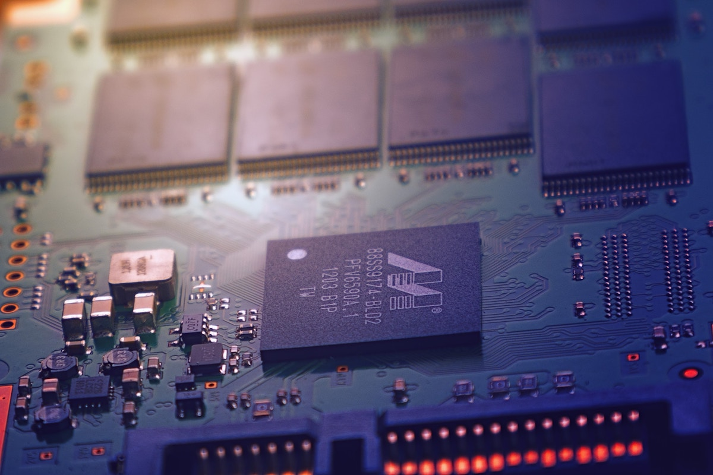
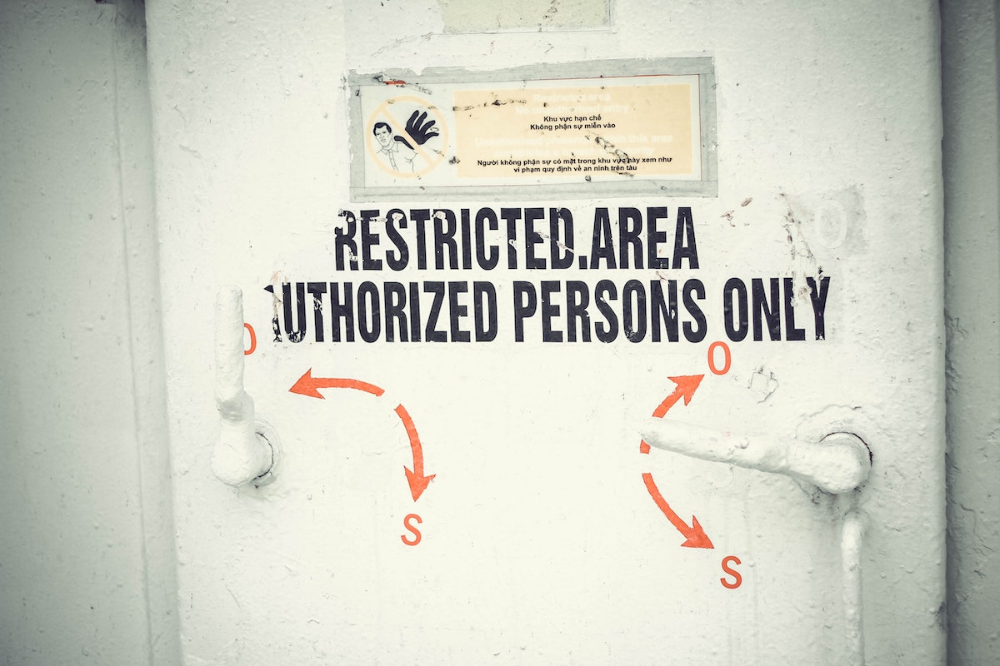

Smart contracts are revolutionizing whole industries and promise to optimize and automate decades-old inefficient 
processes. Africa has already [leapfrogged][1] ahead of the rest of the world into the mobile-first technological 
era. Smart contracts can enable another leapfrog into the [Internet of Agreements][2] era. 

Like with any brave new world, there are some serious caveats and security implications. 
Decision makers must take them into account before making an informed decision. 

This post attempts to go beyond the marketing hype to highlight some key concepts that everyone considering this technology 
should be familiar with. 

# Let's look around us

> Photo by slon_dot_pics from Pexels

The world around us works because of contracts, because of agreements. 

You are reading this blog post on your phone or computer because you purchased the device. 
In other words, there was an agreement between you and the device seller, which was fulfilled once money and device 
changed hands. 

The device making its way from the factory to the shop meant that tens if not hundreds of contracts and agreements had 
to be drafted, agreed, verified and honoured:  
* the factory to the wholesaler,
* the wholesaler to the shipping agent,
* the shipping agent to the shipping company, etc

The device is powered by electricity, because you have a contract with the power company: pay on time, in exchange for 
electricity.  
You get where this is going! Almost every interaction around us happens, has happened and will continue to happen, because 
there is an agreement, a contract, between two or more parties. Written or unwritten, it is recognized and is honoured, 
because it is ultimately enforceable by a "power that be" (state, courts,...)

The majority of these transactions, especially the ones with a small monetary value, happen seamlessly, without us 
even noticing. On the contrary, the higher the value of a transaction the more friction is involved in completing it.  

For example, in a real estate purchase a contract is drafted describing the building/land in detail. In most 
jurisdictions this is drafted by a notary or lawyer (a trusted third party). Both parties sign, the signed contract is 
submitted to the relevant authority (e.g. land registry), the monetary value is transferred in the opposite direction, etc.
All these checks and balances are introduced to secure the interests of the parties involved, as well as comply with 
legal requirements.

# How about some automation?

> Photo by Johannes Plenio on Unsplash

Something seemingly so simple as a title of ownership transfer, involves different trusted third parties, authorities 
and "process gates" to minimise the possibility of mistakes or fraud. In the enterprise domain, e.g. shipping and 
logistics, the contracts and process gates that need to be fulfilled are [even more complex][4] involving multiple 
parties and authorities. 

One answer to this complexity is the introduction of automation. Paper- and rule-based processes have been digitized 
for many years now. Steps are automated and friction is constantly reduced for even the most complex transactional processes. 

One great example of simplification made possible by digitization is [parametric insurance][9]. In it all 
manual processing (claims form, assessment, payout) has been replaced with 1-2 simple and automatic 
rules (e.g. "pay the farmer her insurance if monthly rain is more than 100mm").

However, digitization of contracts in IT systems introduces a critical weak point: centralization in a few data centers. 
This makes critical transactional processes vulnerable to physical (power cuts) and cyber attacks. This was 
demonstrated in a spectacular way in 2017 with the [NotPetya malware][3]. This single virus crippled the multi-national 
shipping company [Maersk][5] along with almost the [entire public infrastructure of Ukraine][6]. 

# A new paradigm

> Photo by Launchpresso on Unsplash

Smart contracts are a new way to address the problem of digitization.  
Built on top of blockchain, they offer automation, without any central points of failure.

Let's unpack this "heavy" definition into more understandable concepts. 

## Blockchain

At its core a blockchain is a *distributed data storage*.  
'Distributed' means from a few computers in a data center to many thousands across the globe. Public blockchains allow 
any computer to connect and become part of them. Private blockchains allow only a preselected set of servers. 

    <iframe allowfullscreen frameborder="0" style="width:640px; height:480px"
        src="https://www.lucidchart.com/documents/embeddedchart/b29b2c36-bc5a-4af7-89f5-651da8d74ca1"
        id="lRl62L5eteGn">
    </iframe>

This diagram shows how a collection of servers/computers can
* form a robust network through [peer-to-peer networking][12], and
* confirm and validate transactions originating from users.  
These transactions belong to (and originate from) users, because they are signed with the users' cryptographic keys.

The nodes participating in the blockchain network, reach a consensus on what the true state of the world is at any given 
moment. This happens without necessarily trusting each other.  
This is a remarkable feature and is achieved through cryptography and game theory incentives.

For a deeper technical analysis this [article][10] and this [article][11] are good starting points.

The important takeaway for our discussion is that **a blockchain is a distributed trust machine**. A way for any 2 
people or systems on the planet to agree on the truth without an intermediary. Social norms, law and institutions 
underpin trust in the real world. Blockchain is now offering this underlying fabric for the digital world.

## The next step

The obvious question then is: how do we fully utilize this trust machine to replicate real world processes? The answer 
is **smart contracts**.

A smart contract is a piece of code which  
* belongs to (and is deployed by) a user on the blockchain network,
* can be called by (and itself can call) other smart contracts, and
* is executed by **all** of the nodes of the network

    <iframe allowfullscreen frameborder="0" style="width:640px; height:480px"
        src="https://www.lucidchart.com/documents/embeddedchart/d65697d0-4df3-4fb5-8de0-5f71f6c8e3ba" id="L9l6W1HWTkXY">
    </iframe>

Smart contracts are a powerful concept.  
Blockchain provides the foundation for random participants to agree on the state of the world (e.g. `A belongs to X`). 
Smart contracts provide the mechanism for anyone to verify **how and when** the state of the world changes (`if W happens, then
A belongs to Y`).  
These changes and state transitions happen  
* **Immutably**: Once recorded they cannot change. 
* **At scale**: Thousands of smart contracts for all kinds of processes can be processing millions of requests.

For a deeper dive in smart contracts this [article][13] and this [article][14] will provide a good context.

# Security and scalability

Smart contracts solve a number of problems in an elegant way.  
However they do not solve *all* problems. As with any technology, there are some important considerations and trade-offs 
to take into account. 

## Which platform and where

> Photo by Nguyen Nguyen from Pexels

Most smart contract networks ([Ethereum][15], [Tezos][16], [EOS][17],...) have been designed to scale on a global level. 
Any computer is incentivised to join their public network and, effectively, increase the network's strength against malicious attacks. 

From a smart contract creator's point of view, this sounds intriguing: deploying on a global platform which never shuts 
down and is resistant to attacks. On the other hand, the default decision of an enterprise or government body is 
probably to deploy everything on its own data centers for security reasons. After all, you can't trust the Internet, can you?

There are some important implications, which make this decision a little bit more involved.

* **Volumes**  
How many transactions should the smart contract process? How quickly?  
A few a day, completed within a couple of hours? Or millions a day, completed within seconds?  
Deploying on a public network means your contract is competing for network resources with others. 
One should seriously consider the current [performance guarantees][18] of a public blockchain platform versus 
deploying smart contracts in private, dedicated data centers. In the latter case, there are no third-party contracts 
allowed, which means no competition for resources, which means higher performance.   
    
* **Privacy of data**  
A smart contract needs to store data, expose callable methods and (in the case of Ethereum) emit events, if it is going 
to be of any use. In a public platform other participants can eavesdrop; not necessarily access the data, but have a 
good feel of traffic/load based on transactions/events on the blockchain.  
Is this something acceptable?  
If yes, then a public blockchain is fine.  If not, the whole system should be ring-fenced in a private network.     
Are the data and actions available to everyone on the network or is access permissioned?    
If permissions are needed, then an enterprise-oriented blockchain like [Corda][21] would be more suitable.  

* **System criticality**  
How critical is the smart contract system?   
For example, a smart contract and blockchain holding all the land titles of the country is a completely different beast 
to, say, an automatic parking ticketing system.  
Losing the former and you have riots in the streets (almost [mission-critical][19] for a country). Lose the latter and 
people are happy :-)  
Critical systems **must** be deployed with [black swan events][20] in mind. Wars, earthquakes, tsunamis, country-wide 
power cuts,...; catastrophic events **will** happen.  
Is the blockchain supported by enough servers around the country (private) or the world (private/public) to survive
and continue functioning?

* **Cost of public tokens**  
Each action which modifies a public blockchain comes with a cost attached; these are the fees for the computers securing 
the network. Deploying a smart contract on a public network, means being ready to fund the cost of it, by buying tokens 
(ETH, XTZ,...) in the public market. Given the historical volatility of cryptocurrency prices, this might not be 
acceptable for an enterprise or government body.  
In this case, a private blockchain system might be the only option. 

## Private keys

> Photo by Skitterphoto from Pexels

We already mentioned that blockchains are based on cryptography. In layman's terms, users and systems identify 
themselves to (and interact with) the blockchain using their private encryption keys.   
These software keys **cannot** be just stored in a server or a hard drive. If they are copied or stolen, the attacker 
will be able to impersonate the user with impunity. In a similar vein, if keys are lost or destroyed, it is an 
irreparable loss. The user can no longer interact with the blockchain; the private encryption keys are truly "the keys 
to the kingdom". 

In an enterprise or government setting, it is imperative that there is a proper [Key Management System][22] in place. 
The most appropriate solution is a [Hardware Security Module][23]. 
This offers full protection against key theft, loss or tampering. At the same time, it allows secure interaction with the 
blockchain and the smart contracts at a high volume.

## Contract logic

> Photo by Pixabay from Pexels

In the real world the law is the law, setting the rules and boundaries.   
If something is unclear, then the judiciary is in charge of interpreting and amending. Even in the extreme case that 
society "changes its mind" on something, in many jurisdictions past actions and agreements can be reversed with 
[ex post facto laws][25].  

In the world of smart contracts "[the code is the law is the law][26]".  
This means that, since a blockchain captures the agreed-upon true state of things, by consequence a smart contract's 
actions are final and irrevocable. Reversing a smart contract is impossible without invalidating the integrity of the 
entire blockchain.  

The most well-known example of this was one of the most publicized smart contract systems created, the [DAO][24].  
In June 2016, some Ethereum blockchain users took advantage of a weak point in the DAO's code and siphoned off the 
equivalent of millions in US dollars from the DAO contract's account.  
Notice that we did **not** use the word "steal"!  
Since in the new world code is law, could it be that the weakness was intentional? I.e. the real-world equivalent of a 
"legal loophole". If the intention was for weaknesses to not be allowed, why was it not cemented in the DAO's code?
      
This discussion can only highlight that a smart contract's code might be as important (if not more) than the code 
running in a nuclear reactor. It has to be checked and tested and verified 1000 times over for any possible and 
impossible situation.  
Once deployed, it is "law". 

## Future-proofing

> Photo by j zamora on Unsplash

Having said that "code is law" does not mean that either code or law remains static.  
The world around us moves. The agreements of today do not use the same terms as they did 10 years go, nor will they be 
the same 10 years from now. 
The last thing an organisation wants is to deploy a smart contract, only to discover a few months later that it cannot 
upgrade it without major disruption. 

Not architecting the smart contracts the right way to make them easy to upgrade will inevitably result in expensive and 
unplanned retrofitting.   
For example, it is realistic to assume that a land registry smart contract will soon end up being used by a large number of 
different systems and applications across the country. In most platforms, simply deploying a new smart contract to add 
some new features will result in the contract's address changing. This means that all the downstream systems which depend 
on it will need to be updated to use the new contract. 
Depending on the nature and number of these systems, this may be prohibitively complex and expensive. 

This problem calls for a deeply technical solution and is different depending on the chosen smart contract platform.   
It requires deep knowledge of the features and restrictions of it.  
For reference, some options (each one with its own pros and cons) are  
* the [proxy contract][30] pattern ([widely][27] [supported][32])
* lazily [migrating data][28]
* separating [data from logic][31]
* using [libraries][29] (if supported) 

## Oracles

> Photo by Pixabay from Pexels

In the world of smart contracts the term **oracle** identifies any trusted source of information and events from the 
external world. The term has its root in ancient Greece. Oracles were believed to be the [undisputable voice of the gods][7]. 
A [golden source][8] of information from the "world beyond".

Remember from the introduction that smart contracts execute in a secure, isolated environment. 
They can be called by users (using their private keys) as well as other smart contracts. 
For their logic to be useful to the real world, smart contracts need to react to real-world events and consume real-world 
information.  
For example:  
> "Is the ship docked in port?"  
> "Has $100 landed in bank account Y?"  
> "What product model does serial number XYZ correspond to?"

These external stimuli result in the smart contract taking some action and recording a side-effect in the blockchain 
for ever. However, the finality of all smart contract actions raises an important question:  
How trust-worthy is the oracle?  
What if it gives the wrong information the moment the contract requests it?

For example, a property purchase smart contract may depend on a banking oracle to confirm that the [fiat money][33] funds 
have landed in the bank account. What if (by accident or malicious action) the banking oracle incorrectly reports that 
the money is there, when it is not? The contract will be triggered and the property title will be irrevocably transferred, 
when in fact it should not.

Depending on the situation and the domain, there are various strategies to address oracle security issues.

* **Own oracle**  
The simplest way to address the issue of oracle security is by implementing the oracle ourselves. 
This way the enterprise does not have to trust any third party for the smart contract information. However, in many cases,
this may be easier said than done. It is one thing to write the code for a weather oracle. It is quite another to 
actually install and weather stations around the world to feed it with data.   

* **Consensus-based decision**  
Another way of mitigating the risk of a compromised oracle is to reach out to more than one. 
For example, reach out to 3 weather providers to get the current temperature. We can then either consider the average or
only the value provided by the majority or oracles. 
In this case a hacker would have to concurrently attack the majority of our oracles to affect the outcome of the smart
contract.  

* **"Cooling off" period**  
Another way to address a compromised oracle would be to check again after a few minutes/hours/days. If the value is 
the same in both calls, then the transaction can be completed. 
If the business domain logic allows it, this approach adds an additional hurdle for an attacker: not only to take control 
of an oracle but also keep it for a prolonged period of time without being discovered.  

* **Indemnity covenant**  
In the case of a paid-for oracle (i.e. the smart contract owners pay the oracle to supply information), adding an 
indemnity covenant is a must. 
With it the oracle provider is solely responsible for the correct function of the oracle. If a material loss arises because of 
incorrect data, then it would be up to the oracle provider to indemnify. 
The question then is: *how do we prove in the future that the oracle returned a given value?*  
For web-based oracles (i.e. web sites, APIs,...) the answer already exists in the form of TLS notaries. 
Using the [properties of the TLS security protocol][34], the smart contract can generate a non-repudiating signature 
of the value returned by the oracle. 
In simple words, this is the equivalent of asking someone to take their own photo with their own camera and we keep it 
as future proof.  

# Parting thought

> Photo by Pixabay from Pexels

Blockchain and smart contracts have the potential to revolutionize everyday life and interactions in a similar way that 
internet and the smartphone did.  
There are however some important considerations and security concerns to address.  
Designing, coding, deploying and maintaining a smart contract system requires skill, extreme preparation and diligence.  
Once the rocket takes off, you want all systems to function perfectly.

  [1]: https://www.worldbank.org/en/news/opinion/2017/10/11/africa-can-enjoy-leapfrog-development
  [2]: https://en.wikipedia.org/wiki/Smart_contract
  [3]: https://www.wired.com/story/notpetya-cyberattack-ukraine-russia-code-crashed-the-world/
  [4]: https://transporteca.co.uk/shipping-process/
  [5]: https://www.zdnet.com/article/ransomware-the-key-lesson-maersk-learned-from-battling-the-notpetya-attack/
  [6]: https://en.wikipedia.org/wiki/2017_cyberattacks_on_Ukraine
  [7]: https://en.wikipedia.org/wiki/Oracle
  [8]: https://whatis.techtarget.com/definition/golden-record
  [9]: https://en.wikipedia.org/wiki/Parametric_insurance
  [10]: https://blockchainhub.net/blockchain-intro/
  [11]: https://bitsonblocks.net/2015/09/09/gentle-introduction-blockchain-technology/
  [12]: https://en.wikipedia.org/wiki/Peer-to-peer
  [13]: https://hackernoon.com/everything-you-need-to-know-about-smart-contracts-a-beginners-guide-c13cc138378a
  [14]: https://blockgeeks.com/guides/smart-contracts/
  [15]: https://www.ethereum.org/
  [16]: https://tezos.com/
  [17]: https://eos.io/
  [18]: https://medium.com/blockchannel/the-case-for-ethereum-scalability-a66ed08d0bed
  [19]: https://www.netmotionsoftware.com/blog/mobility/mission-critical-systems
  [20]: https://en.wikipedia.org/wiki/Black_swan_theory
  [21]: https://www.corda.net/
  [22]: https://en.wikipedia.org/wiki/Key_management
  [23]: https://en.wikipedia.org/wiki/Hardware_security_module
  [24]: https://en.wikipedia.org/wiki/The_DAO_(organization)
  [25]: https://en.wikipedia.org/wiki/Ex_post_facto_law
  [26]: https://journals.openedition.org/factsreports/4518
  [27]: https://medium.com/the-cryptonomic-aperiodical/building-up-blockchains-tezos-proxy-contract-616b55dfdca8
  [28]: https://medium.com/bitclave/the-easy-way-to-upgrade-smart-contracts-ba30ba012784
  [29]: https://hackernoon.com/how-to-write-upgradable-versioned-smart-contracts-in-solidity-910007057943
  [30]: https://hackernoon.com/how-to-make-smart-contracts-upgradable-2612e771d5a2
  [31]: https://blog.trailofbits.com/2018/09/05/contract-upgrade-anti-patterns/
  [32]: https://github.com/EOSIO/Documentation/blob/master/TechnicalWhitePaper.md#easy-upgrades-and-bug-recovery
  [33]: https://en.wikipedia.org/wiki/Fiat_money
  [34]: https://tlsnotary.org/