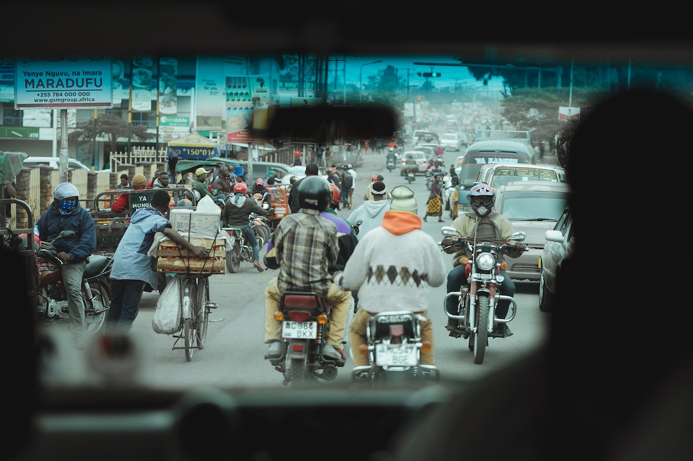
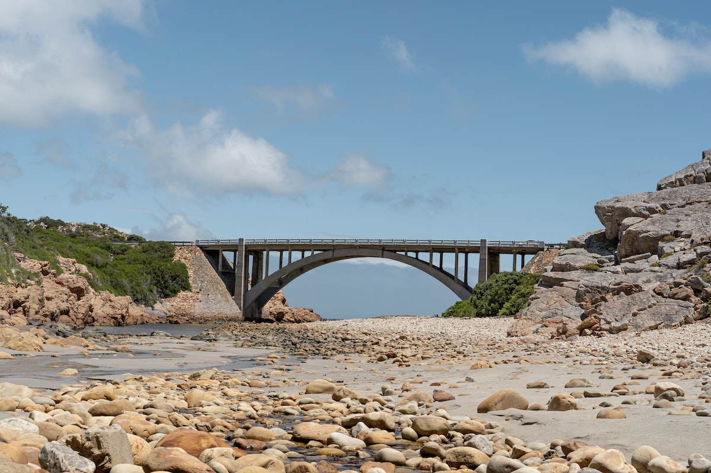
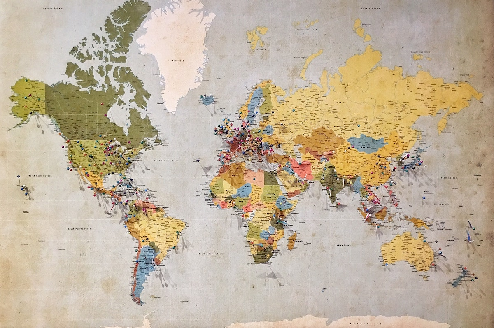
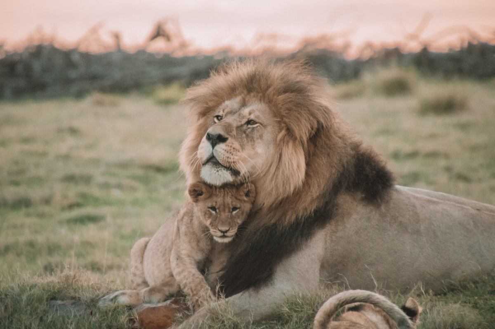
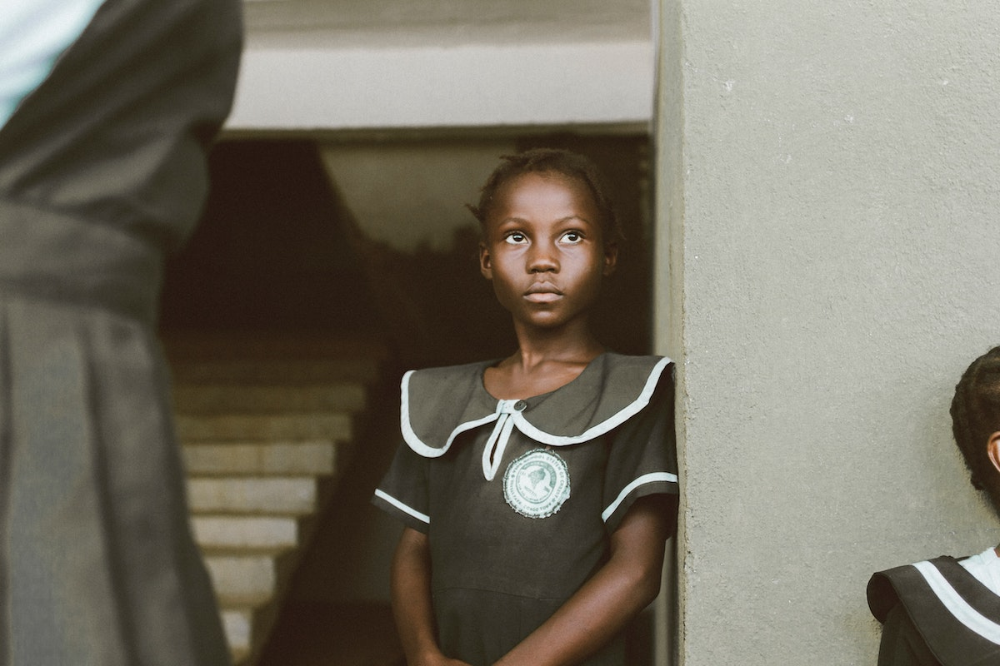
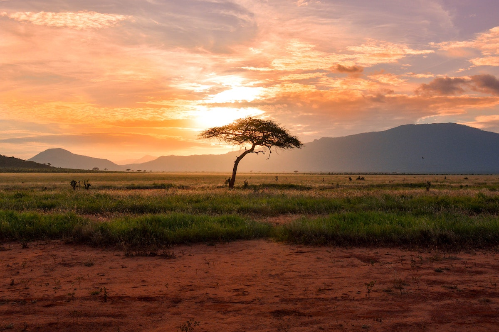

The COVID-19 pandemic is a hard test for all countries and societies. 
Especially so for the developing and emerging economies of the African continent. 

This article explores some options and policies specifically tailored for African countries. These can be easily adopted 
and implemented, minimising the economic and societal impact of the current disruption. 

# A challenging time

> Photo by Sharon McCutcheon on Unsplash

Even in good times, most African countries’ [healthcare systems are nonpermissive][1].  
If Africa was to experience a COVID-19 [epidemic curve][2] similar to Europe, China or America, the death toll would be 
devastating, likely much worse than any other continent.   
Therefore the solution for Africa is to prevent rather than contain the virus. African countries have had the thankless 
task of dealing with epidemics such as Ebola in the past. This experience has shown that the outbreak is primarily a 
health and logistics problem. It is the aftermath which economically impacts the region or the entire society and 
hinders development.   
COVID-19 is not an epidemic; it is a [pandemic][3]. It is much more virulent than anything any African country has ever 
experienced, it has gone global and can very easily overwhelm the health system of any country. 

While focusing their efforts to prevent the virus from spreading, African leaders need to also start preparing for the 
aftermath.   
The global economy is already [severely shaken][4]. Africa has to start taking action now to counteract the after-effects of 
the disruption. Failing to do so will almost certainly damage the [economic development of most African countries][5]. The 
cascading effects could range from political instability and protectionism to collapse of business activity and regional 
conflict.

The following sections provide a set of actions and policies, which African governments should start pursuing today.

# 1. Support people and the real economy

> Photo by Hugo Ramos on Unsplash

SMEs are the back-bone of [African economies][6] with the [vast majority][7] of people being either in the informal sector or 
self-employed. In addition, most African countries are [net food importers][8], highly vulnerable to swinging food prices, 
the most recent example being the [2007 crisis][9].    
Unlike developed economies and larger corporations, African SMEs and individuals do not have the cash buffers or access 
to cheap credit to weather this storm. Despite their limited means, African governments must take immediate action to 
protect their most valuable assets: their people and their businesses. This is a global pandemic, so the world has many 
examples to offer of successful policies in both fronts.  

Direct [food hand-outs][10] offer immediate relief and are indispensable. They can also be an easy [breeding ground for 
corruption][11]. In the medium and longer term, Africa should leverage its own invention, Mobile-Money/M-Pesa, to enable 
direct transfer to the neediest. India provides an excellent example here; since the introduction of direct digital 
payments to its extensive benefits program, they were able to make a staggering [$3.7 billion in annual savings][12] due to 
eradication of corruption.  

With regards to business assistance, the measures taken around the world provide a rich “toolbox” of examples to pick 
from. For example:  
* Country-wide temporary reduction in rents, like [in Greece][13].
* Deferring [tax payments][14], most especially for heavily affected sectors, such as tourism, transport and hospitality.
* Loan extensions and [mortgage holidays][15]. 
* Additional borrowing with preferential terms for SMEs.
* Μobile money providers temporarily voiding transaction fees and data caps, like [in the UK][26], to facilitate the 
recovery of SMEs.

The governments and Central banks can back these measures up by providing guarantees and additional liquidity. The 
upwardly cascading nature of these measures will allow intermediate participants (business owners, property owners, 
banks,...) to assume part of the restructuring burden.

# 2. Reach out

> Photo by The Climate Reality Project on Unsplash

The last decades have seen a tremendous increase in African exports to the rest of the world with per capita exports 
rising by an impressive [13% a year on average][16]. This has resulted in 80% - 90% of its trade being with external countries, 
making Africa the [most outward-looking continent][17].  

These ties and trade relations need to be strengthened with all countries.   
The temporary restrictions of COVID-19 are threatening to become permanent, with the economic shock causing a knee-jerk 
reaction. Many countries are considering or implementing a return to [protectionism][18]. Though it is debatable whether these 
measures will have the desired effect (stimulate the domestic economy), their side-effect is almost certain: impact 
export-oriented African businesses, like horticultural exports to Europe.   

Movement of people is also impacted, far beyond the normal distancing measures. From President Trump’s [suspension][19] of all 
forms of immigration to [unfair targeting of African nationals in Guangzhou][20], intolerance is rearing its head.   
For a continent dependent on the export of goods and human capital, these are not good signs. African leaders can and 
should be proactive in confirming existing international agreements, like WTO’s [Trade Facilitation Agreement][21], and 
discussing new export opportunities which are [currently emerging][22]. 

# 3. Reach across

> Photo by Shotlist on Unsplash

African economies need to focus on intra-continental trade.  
The flip-side of the export success story is that intra-African trade is still miniscule, [roughly 2% of total][23]. Africa 
has put all its trade “eggs in one basket”.  
Cooperation and removal of barriers are key, to minimise the impact of international trade reduction. With global demand 
plummeting and [oil prices at record lows][24], commodity-exporting countries will be strongly affected.
   
At this junction, African economies have 2 complementary options in front of them.  
* Mono-product economies must diversify and invest into other sectors, like Agriculture and SMEs (e.g. heavily 
oil-dependent ones, like Nigeria and Angola).
* The continent as a whole must actively pursue and encourage an increase in regional trade, by actively pursuing the 
enactment of the [African Continental Free Trade Agreement][25]. 

# 4. Assert the position

> Photo by Andrew Stutesman on Unsplash

The global order has been changing this last decade. 
The world has turned [multi-polar][27], with global (US, China) and regional (EU, India, Russia,...) powers jostling 
for control. The African continent sits squarely in the middle of this modern-day [“Great Game”][28]; African economies 
maintain ties and trade with all countries.   

Africa needs to assert its place in the changing world order, economically and geopolitically. In a [“rising East”][29] vs. 
[“declining West”][30] environment, African countries have a unique opportunity to reach out as a uniform block. 
Cooperation is key, when it comes to international trade negotiations.  
This can exert powerful influence to gain preferential treatment for African trade and migrants.  

# 5. Well-run administrations

> Photo by Christina @ wocintechchat.com on Unsplash

The COVID-19 [black swan event][31] demonstrated in the most spectacular way the importance of competent governance. 
Even the strongest economies are not safe from the combination of a catastrophe and [sub-par leadership][32] or 
[unfit-for-the-job advisors][33].  

The future only holds more surprises, from another virulent outbreak to climate change disruption. African governments 
must prepare themselves for these events by enforcing strong laws against corruption and cronyism. Country reserves, 
grants and loans from international institutions should be well-accounted for and invested in the future of society as 
a whole. Administration and management positions must attract only the best and brightest, regardless of connections. 
The well-educated local technocrats and African diaspora can provide a deep talent pool.  
Failure to do so now will leave African states ill-prepared for the next calamity and result in permanent poverty and conflict.

# 6. Protect Wildlife

> Photo by Brianna Reak on Unsplash

Africans have a long history of poaching, often illegally, with [5 million tons of bushmeat killed in Congo alone][34]. 
This practice has [almost certainly][35] resulted in the past zoonotic pandemics of HIV and Ebola.  
Poverty, as well as the constant demand for [animal material][36] from traditional Asian medicine, will almost certainly 
lead to an increase of poaching. The coronavirus, and its connection to [possible human consumption of bats][37] has put 
an intense focus on human-animal interaction.   

African countries should set the strictest laws and regulations on protecting their environment and wildlife. Poaching, 
export and consumption of wildlife must be reduced and eventually completely stopped. Populations must be educated and 
trespassers severely punished.   
Saving the wildlife is not just “good for the environment” or to boost the tourism sector. It can become literally a 
matter of life and death. If the next pandemic starts from Africa’s poaching practices the world might not be forgiving. 

# 7. Invest in real strength

> Photo by Adrianna Van Groningen on Unsplash

Last but not least, African nations must make it a priority to allocate more resources more efficiently in their 
healthcare systems and education.  

Africa is the only continent which has [consistently reduced its military spending][38] for years. However these savings 
have not translated into better education. African nations spend the same percent of GDP on education as other countries, 
but the efficiency of that investment is [extremely low][39]. African governments need to revamp their approach to 
education; the money they spend should be more effective in educating the next generation of doctors, engineers and 
business leaders.
   
In healthcare, 20 years on from the [Abuja declaration][40], no African country has achieved the goal of [15% GDP spent 
on public health][41]. Most Africans pay well over 40% out-of-pocket expenses for health care, with most countries 
offering low quality services.  
COVID-19 and the global trade war in the backdrop have demonstrated that healthcare and education will be this century’s 
arms races.  

# Conclusion 

> Photo by Damian Patkowski on Unsplash

Even if the coronavirus magically disappeared tomorrow nothing will ever be the same again.  
The world is a different place with economies and societies entering a prolonged recession. Moreover the simmering rift 
between East-West and the strains in global supply chains, have shown the danger for a country being ill-prepared and 
not belonging to a trade bloc.   

African countries have both an incentive and an opportunity to change and closely cooperate.  This will help them come 
out stronger on the other side of this crisis.

  [1]: https://www.aljazeera.com/news/2020/03/covid-19-africa-told-prepare-worst-response-200319085112877.html
  [2]: https://en.wikipedia.org/wiki/Epidemic_curve
  [3]: https://www.dictionary.com/e/epidemic-vs-pandemic/
  [4]: https://www.wto.org/english/news_e/pres20_e/pr855_e.htm
  [5]: https://www.brookings.edu/blog/africa-in-focus/2020/03/18/strategies-for-coping-with-the-health-and-economic-effects-of-the-covid-19-pandemic-in-africa/
  [6]: http://www.intracen.org/uploadedFiles/intracenorg/Content/Publications/Africa_SME%20web.pdf
  [7]: https://qz.com/africa/1759070/economists-struggle-to-figure-out-where-africas-informal-economy-starts-or-where-it-ends/
  [8]: http://www.fao.org/3/a-i2497e.pdf
  [9]: https://en.wikipedia.org/wiki/2007%E2%80%9308_world_food_price_crisis
  [10]: https://africanarguments.org/2020/03/25/covid-19-africa-food-systems/
  [11]: https://www.theeastafrican.co.ke/news/ea/Ugandan-officials-arrested-for-inflating-relief-food-prices/4552908-5519676-qxf2y1/index.html
  [12]: https://www.livemint.com/news/india/govt-saved-rs-1-7-trillion-via-direct-transfer-of-subsides-says-president-11580457232905.html
  [13]: https://www.orbitax.com/news/archive.php/Greece-Provides-Rent-Relief-fo-41720
  [14]: https://www.chathamhouse.org/expert/comment/how-fight-economic-fallout-coronavirus
  [15]: https://www.theguardian.com/money/2020/mar/17/uk-banks-set-out-details-of-covid-19-mortgage-holidays
  [16]: https://www.nber.org/digest/jul11/w16597.html
  [17]: https://unctad.org/en/pages/PressRelease.aspx?OriginalVersionID=520
  [18]: https://www.theguardian.com/world/2020/apr/08/global-trade-will-be-vital-to-the-economic-recovery-from-covid-19
  [19]: https://thehill.com/homenews/administration/494230-trump-signs-executive-order-limiting-immigration
  [20]: https://edition.cnn.com/2020/04/10/china/africans-guangzhou-china-coronavirus-hnk-intl/index.html
  [21]: https://www.wto.org/english/tratop_e/tradfa_e/tradfatheagreement_e.htm
  [22]: https://www.who.int/news-room/detail/03-03-2020-shortage-of-personal-protective-equipment-endangering-health-workers-worldwide
  [23]: https://unctad.org/en/pages/PressRelease.aspx?OriginalVersionID=520
  [24]: https://www.theguardian.com/business/2020/apr/10/opec-russia-reduce-oil-production-prop-up-prices
  [25]: http://www.tralac.org/resources/our-resources/6730-continental-free-trade-area-cfta.html
  [26]: https://www.theguardian.com/world/2020/mar/29/broadband-providers-to-lift-data-caps-during-covid-19-lockdown
  [27]: https://geopoliticalfutures.com/multipolar-world-emerging/
  [28]: https://en.wikipedia.org/wiki/The_Great_Game
  [29]: https://www.theguardian.com/world/2020/apr/11/coronavirus-who-will-be-winners-and-losers-in-new-world-order
  [30]: https://foreignpolicy.com/2020/03/23/death-american-competence-reputation-coronavirus/
  [31]: https://en.wikipedia.org/wiki/Black_swan_theory
  [32]: https://www.nytimes.com/2020/04/11/us/politics/coronavirus-trump-response.html
  [33]: https://foreignpolicy.com/2020/03/17/britain-uk-coronavirus-response-johnson-drops-go-it-alone/
  [34]: https://link.springer.com/article/10.1023/A:1008877309871
  [35]: https://www.dailymail.co.uk/sciencetech/article-3816514/Get-ready-HIV-Ebola-Experts-warn-BUSHMEAT-cause-new-food-pandemic.html
  [36]: https://www.reuters.com/article/us-china-tcm/as-china-pushes-traditional-medicine-globally-illegal-wildlife-trade-flourishes-idUSKCN1R90D5
  [37]: https://www.who.int/health-topics/coronavirus/who-recommendations-to-reduce-risk-of-transmission-of-emerging-pathogens-from-animals-to-humans-in-live-animal-markets
  [38]: https://www.defenceweb.co.za/land/land-land/african-military-spending-continues-to-decrease/
  [39]: https://www.brookings.edu/blog/africa-in-focus/2020/02/13/figures-of-the-week-public-spending-on-education-in-africa/
  [40]: https://www.who.int/healthsystems/publications/abuja_declaration/en/
  [41]: https://www.afro.who.int/sites/default/files/2017-06/state-of-health-financing-afro.pdf